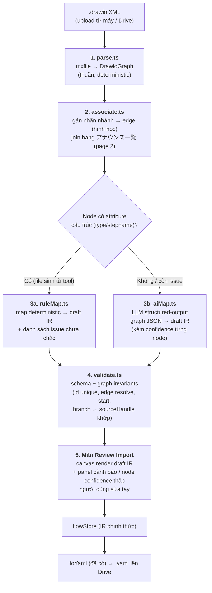

# Thiết kế: Import file Draw.io (XML) → sinh YAML flow

> Tài liệu thiết kế để review trước khi code. Chưa implement gì.
> Input mẫu đã phân tích: `四谷メディカルキューブ 診療(デモ0714更新)` — file `.drawio` 2 page.

## 1. Bài toán

Người thiết kế nghiệp vụ vẽ flow AI電話 bằng Draw.io. Ta cần đọc file `.drawio` (XML)
và sinh ra YAML đúng schema của hệ thống (`fromYaml`/`toYaml` hiện có), để mở được
trong Scenario Flow Builder và chạy trên Brekeke.

**Nguyên tắc giữ nguyên kiến trúc hiện tại:** IR vẫn là source of truth.
Draw.io chỉ là **một adapter import mới** đứng cạnh `fromYaml`:

```
.drawio XML ──▶ [drawio adapter] ──▶ FlowIR ──▶ canvas (review/sửa) ──▶ toYaml ──▶ .yaml
```

AI **không bao giờ sinh YAML trực tiếp**. AI chỉ tham gia ở bước map "hình vẽ tự do →
IR", còn YAML luôn do `toYaml` (deterministic, đã có test) sinh ra. Nhờ vậy output
luôn hợp lệ về mặt cấu trúc.

## 2. Những gì rút ra từ file mẫu

Phân tích file `TEST.drawio` đính kèm:

| Thành phần | Thực tế trong file | Hệ quả thiết kế |
|---|---|---|
| Page 1 `全体フロー図` | 37 node flow là `<object>` wrapper có attribute cấu trúc: `stepname`, `type` (`opening`=1, `hearing`=30, `termination`=6), `announce`, `repeat` | File "chuẩn" có thể map **rule-based, không cần AI** |
| Edge | 47 `mxCell edge` nối bằng `source`/`target` id | Dựng `FlowEdge` trực tiếp |
| Nhãn nhánh (はい/いいえ/初診/再診…) | Là text cell **trôi tự do** (`elbl_*`, parent=`1`), KHÔNG gắn vào edge | Phải gán nhãn↔edge bằng **hình học** (khoảng cách tới đường đi của edge); đây là chỗ mơ hồ nhất, cần AI/người xác nhận |
| Page 2 `アナウンス一覧` | Bảng 聴取項目/復唱/リトライ/失敗時/発話文言, khóa theo id node page 1 (`p2_repeat_<id>`, `p2_retry_<id>`, `p2_fail_<id>`) | Join theo id để lấy `reconfirm`, `retryCount`, hành vi `failed`, câu thoại đầy đủ cho node `interaction` |
| Node id | Bị mangle: tên tiếng Nhật → `___`, `____`, `_______` (khó đọc, dễ nhầm) | Phải **sinh lại id tiếng Anh có nghĩa** (`ask_visit_history`…) — việc AI làm tốt từ label tiếng Nhật |
| Vị trí node | `mxGeometry` đầy đủ | Có thể giữ làm layout ban đầu, hoặc bỏ và chạy `ir/layout.ts` |

⚠️ File mẫu này vốn được sinh ra từ YAML bằng tool (agent ghi `yaml-to-drawio skill v2`),
nên mới có attribute cấu trúc. **File do người vẽ tay sẽ không có** — chỉ có hình chữ
nhật + text + màu. Thiết kế vì vậy có 2 làn: rule-based cho file chuẩn, AI cho file tự do.

## 3. Kiến trúc tổng thể



Bước 1–2–4 hoàn toàn deterministic và test được. AI chỉ nằm ở 3b, và output của AI
bắt buộc đi qua validate + người review trước khi thành IR chính thức.

## 4. Cấu trúc code mới

```
src/drawio/                 # THUẦN như ir/ — không import React
  types.ts                  # DrawioGraph, DrawioNode, DrawioEdge, AnnounceTableRow, ImportIssue
  parse.ts                  # XML (DOMParser) → DrawioGraph; hỗ trợ page nén deflate+base64 (pako)
  associate.ts              # nhãn↔edge theo hình học; join page アナウンス一覧 theo id
  ruleMap.ts                # DrawioGraph → { draft: FlowIR, issues: ImportIssue[] }
  validate.ts               # invariant check dùng chung cho cả 2 làn
  drawio.test.ts            # unit test, fixture = file TEST.drawio rút gọn
src/ai/                     # tầng gọi LLM, tách khỏi drawio/ để tái dùng sau này
  LlmClient.ts              # interface + implementation (fetch); swappable transport
  drawioMapPrompt.ts        # prompt + JSON schema of IR (structured output)
  aiMap.ts                  # gọi LLM, validate JSON trả về, retry kèm lỗi
src/components/
  ImportDrawioModal.tsx     # upload file, chạy pipeline, hiện tiến trình
  ImportReviewPanel.tsx     # danh sách issue/confidence, click → focus node trên canvas
fixtures/
  sample-flow.drawio        # fixture test
```

Điểm nối vào app: thêm mục "Import Draw.io" ở Toolbar/HeaderMenu (cạnh chỗ import YAML
hiện tại — `flowStore` đã có action nhận text và gọi `fromYaml`; ta thêm action
`importDrawio(xmlText)` tương tự nhưng trả về draft + issues thay vì set thẳng).

## 5. Quy tắc map (ruleMap — làn không cần AI)

Với file có attribute cấu trúc như file mẫu:

| Draw.io | IR |
|---|---|
| `type="opening"` + `announce` | node `announce` (text = announce) |
| `type="hearing"` + announce, 1 edge ra | `interaction` (announce, inputType/retry từ bảng page 2) |
| `type="hearing"` + **nhiều edge ra có nhãn** | tách thành `interaction` + `nexus` (mỗi nhãn nhánh → 1 `branch { when, to }`) — vì IR không cho `interaction` mang branches tự do |
| `type="termination"` có câu thoại | `announce` + `hangup` (giống pattern `closed_announce → hangup` trong sample YAML) |
| `type="termination"` không thoại | `hangup` |
| Node đầu tiên (không có edge vào) | `flow.start` trỏ tới nó (node `__start__` tổng hợp như hiện tại) |
| Bảng page 2: 復唱/リトライ/失敗時 | `reconfirm`, `retryCount`, edge `failed` → node xử lý thất bại |
| Label tiếng Nhật | giữ làm `label`; **id mới** sinh bằng slug tiếng Anh (AI gợi ý hoặc romaji fallback) |

Mọi chỗ rule không quyết được (nhãn nhánh không gán được vào edge nào, node màu lạ,
text không rõ loại…) → đẩy vào `issues[]`, KHÔNG đoán bừa.

## 6. Làn AI (aiMap) — dùng khi nào và chạy ở đâu

**Dùng khi:** file vẽ tay không có attribute; hoặc rule-based còn `issues` (gán nhãn
nhánh, phân loại node mơ hồ, sinh id/branch condition từ text tiếng Nhật).

**Cách gọi:** 1 request structured-output. Input = DrawioGraph đã chuẩn hoá (JSON gọn:
id, text, màu, hình, toạ độ, edges, bảng page 2) + JSON Schema của FlowIR + few-shot
(cặp drawio-fragment → IR-fragment lấy từ chính file mẫu này). Output = draft FlowIR
+ `confidence` per node. Nếu validate fail → retry 1 lần kèm thông báo lỗi. Flow lớn
(>~100 node) chia theo subgraph liên thông rồi ghép.

**Chạy ở đâu — cần bạn quyết (app là static site, không backend):**

| Phương án | Ưu | Nhược |
|---|---|---|
| **A. Gọi thẳng API LLM từ browser, key do user dán vào** (lưu localStorage như Drive token) | Không cần hạ tầng, làm nhanh nhất — hợp pilot nội bộ | Key nằm ở client; mỗi người phải có key |
| **B. Serverless proxy (Cloud Run / Cloudflare Worker) giữ key công ty, verify Google ID token server-side** ✅ đề xuất cho bản chính | Key an toàn; tiện thể giải quyết luôn mục "verify auth server-side" trong README §Bảo mật; kiểm soát cost/log tập trung | Phải dựng + vận hành 1 endpoint |
| C. Không AI ở v1 — chỉ rule-based, chỗ mơ hồ để người sửa tay trên canvas | Zero hạ tầng, file mẫu của bạn đã đủ cấu trúc để chạy làn này | File vẽ tay tự do sẽ import ra nhiều lỗ hổng phải sửa tay |

`LlmClient` viết dạng interface nên đổi A → B sau này không đụng logic map.
Model: hệ thống đang dùng OpenAI (node `openai`) nên mặc định OpenAI API; đổi
provider chỉ là đổi implementation của `LlmClient`.

## 7. Màn Review Import (bắt buộc, kể cả làn rule)

Import KHÔNG ghi đè flow ngay. Pipeline trả về `{ draft, issues }` →

1. Canvas render draft IR (dùng chính `irToReactFlow` hiện có).
2. Panel bên phải liệt kê issues: node confidence thấp, nhãn nhánh chưa gán,
   node không phân loại được — click issue → focus node.
3. Người dùng sửa trực tiếp bằng NodeSettingsPanel hiện có.
4. Bấm "Xác nhận" → draft thành IR chính thức trong `flowStore` → Save lên Drive
   qua đường `toYaml` bình thường.

## 8. Lộ trình đề xuất

- **Phase 1 (không AI):** `src/drawio/` parse + associate + ruleMap + validate
  + modal import + màn review. File mẫu của bạn import được end-to-end ở phase này.
  Unit test với fixture rút gọn từ file mẫu.
- **Phase 2 (AI):** `src/ai/` + aiMap cho file vẽ tay tự do + confidence UI.
  Cần chốt phương án A/B ở §6 trước khi làm.
- **Phase 3 (sau):** nâng chất lượng — few-shot library theo mẫu vẽ của từng người
  thiết kế, export ngược IR → drawio (đóng vòng tròn với tool yaml-to-drawio đang có).

## 9. Câu hỏi cần chốt khi review

1. **AI transport:** chọn A (key user, nhanh) hay B (serverless proxy, an toàn) — hay đi C→A→B theo phase?
2. **Id node:** sinh id tiếng Anh mới (đề xuất) hay giữ id gốc drawio?
3. **Vị trí node:** giữ toạ độ từ drawio làm layout ban đầu, hay bỏ và chạy auto-layout `ir/layout.ts` (đề xuất: chạy auto-layout cho thống nhất)?
4. **Nguồn file:** chỉ upload từ máy, hay đọc luôn `.drawio` từ cây Google Drive hiện có?
5. File drawio của các 施設 khác có cùng format 2-page (フロー図 + アナウンス一覧) không? Nếu format bảng page 2 ổn định thì rule join làm chặt được, không cần AI cho phần đó.
