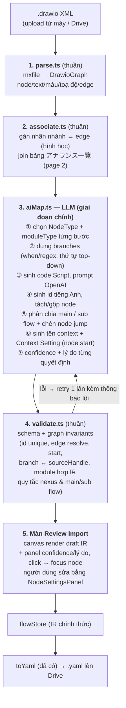

# Thiết kế: Import file Draw.io (XML) → sinh YAML flow

> Tài liệu thiết kế để review trước khi code. Chưa implement gì.
> Input mẫu đã phân tích: `四谷メディカルキューブ 診療(デモ0714更新)` — file `.drawio` 2 page.
>
> **Rev 2** (sau góp ý review): LLM là **giai đoạn chính** của pipeline, không phải
> fallback — vì chọn node/module cho các điểm rẽ nhánh, sinh code Script, và quyết định
> chỗ nào dùng module OpenAI đều đòi hỏi hiểu câu thoại + bối cảnh nghiệp vụ.

## 1. Bài toán

Người thiết kế nghiệp vụ vẽ flow AI電話 bằng Draw.io. Ta cần đọc file `.drawio` (XML)
và sinh ra YAML đúng schema của hệ thống (`fromYaml`/`toYaml` hiện có), để mở được
trong Scenario Flow Builder và chạy trên Brekeke.

**Nguyên tắc giữ nguyên kiến trúc hiện tại:** IR vẫn là source of truth.
Draw.io chỉ là **một adapter import mới** đứng cạnh `fromYaml`:

```
.drawio XML ──▶ [drawio adapter: parse + LLM map] ──▶ FlowIR ──▶ canvas (review/sửa) ──▶ toYaml ──▶ .yaml
```

LLM **không bao giờ sinh YAML trực tiếp**. LLM sinh **IR draft** (JSON theo schema
`FlowIR`), output bắt buộc qua validate + người review trên canvas; YAML luôn do
`toYaml` (deterministic, đã có test) sinh ra — nhờ vậy output luôn hợp lệ về cấu trúc.

## 2. Những gì rút ra từ file mẫu

| Thành phần | Thực tế trong file | Hệ quả thiết kế |
|---|---|---|
| Page 1 `全体フロー図` | 37 node flow là `<object>` wrapper có attribute: `stepname`, `type` (`opening`=1, `hearing`=30, `termination`=6), `announce`, `repeat` | Parser lấy được text/loại thô — nhưng `hearing` KHÔNG đủ để chọn node IR (xem §5) |
| Edge | 47 `mxCell edge` nối bằng `source`/`target` id | Dựng skeleton graph deterministic |
| Nhãn nhánh (はい/いいえ/初診/再診…) | Text cell **trôi tự do** (`elbl_*`, parent=`1`), KHÔNG gắn vào edge | Gán nhãn↔edge bằng hình học (khoảng cách tới path của edge); LLM xác nhận lại chỗ mơ hồ |
| Page 2 `アナウンス一覧` | Bảng 聴取項目/復唱/リトライ/失敗時/発話文言, khóa theo id node page 1 (`p2_repeat_<id>`…) | Join theo id → `reconfirm`, `retryCount`, hành vi thất bại, câu thoại đầy đủ |
| Node id | Bị mangle: tên tiếng Nhật → `___`, `____` | LLM sinh id tiếng Anh có nghĩa (`ask_visit_history`…) |
| Vị trí node | `mxGeometry` đầy đủ | Bỏ, chạy `ir/layout.ts` cho thống nhất (chốt khi review) |

File vẽ tay của designer sẽ không có attribute `<object>` — chỉ có hình + text + màu.
Pipeline vì vậy thiết kế để chạy được với input tối thiểu là "hình + text + dây".

## 3. Vì sao map node/module bắt buộc cần LLM

Điểm mấu chốt (từ góp ý review): một node `hearing` có nhiều edge ra **không map máy móc
được** thành `interaction + nexus`. Phải hiểu câu thoại và bối cảnh mới chọn đúng
node/module trong hệ thống:

- Hearing chỉ cần **lưu** câu trả lời (không rẽ nhánh): `interaction --next--> nexus`
  (nexus save input qua saveContext/contextName/contextType, 1 nhánh next).
- Hearing cần **rẽ nhánh**: interaction KHÔNG nối thẳng vào nexus. Bắt buộc có node
  xử lý đứng giữa: `interaction --next--> logic (xử lý) --> nexus (lưu KẾT QUẢ của
  logic + phân branch)`. Nexus luôn là nơi lưu kết quả và toả nhánh, không tự xử lý.
- Nhánh `failed` của interaction KHÔNG bao giờ vào nexus — đi đường riêng
  (retry announce / hangup / transfer theo bảng 失敗時 ở page 2).
- Hỏi tên bệnh viện / tên công ty / tên đoàn thể bảo hiểm bằng giọng nói →
  `interaction --next--> openai --next--> nexus (lưu)`: openai đứng giữa để bỏ filler
  word / trích đúng tên thực thể (cách dùng OpenAI ưu tiên hiện tại), thành công mới
  tới nexus lưu context; nhánh `failed` của openai **hội tụ về cùng đích** với nhánh
  failed của interaction.
- Rẽ nhánh theo khoa khám → `classifier` module **Clinical Department Classifier**
  (kèm danh sách khoa → output).
- Rẽ theo ngày làm việc / thời điểm gọi / loại số gọi đến → `classifier` module
  **Clinic Days / Date Of Call / Incoming Classifier**.
- Kiểm tra số điện thoại, xác nhận lại ngày sinh → `normalization`
  (**Phone Normalization / DOB Re-confirmation**).
- Điều kiện tuỳ biến (giờ nhận cuộc gọi, cờ trạng thái…) → `logic` module **Script**
  — LLM **sinh code JS** từ mô tả (như `check_hours` trong sample-flow.yaml),
  hoặc **CMR / MRB / Null Check** khi khớp pattern.
- Kết quả phân nhánh phải sinh đúng quy ước hệ thống: branch đánh giá **top-down**,
  `FAILED = TIMEOUT|ERROR|NO_RESULT|INVALID`, catch-all `.*` nằm cuối
  (theo `nodeSchema.ts`).

⇒ Đây là quyết định ngữ nghĩa + sinh code + sinh prompt — đúng vùng của LLM.
Phần deterministic chỉ lo **skeleton**: node nào, text gì, nối với node nào.

## 4. Kiến trúc tổng thể



Bước 1–2–4 deterministic, test được độc lập. Bước 3 là LLM nhưng bị kẹp giữa
parser và validator + human review, nên sai sót của model luôn bị chặn lại trước
khi thành YAML.

## 5. Input cho LLM: catalog module + playbook chọn node

LLM chỉ chọn đúng khi biết hệ thống có gì và quy ước dùng khi nào. Prompt gồm 3 phần:

**(a) Catalog node/module** — sinh từ `src/ui/nodeSchema.ts` (một nguồn, không viết
tay 2 nơi để khỏi lệch khi thêm module mới):

| NodeType | Module | Tham số chính | Nhánh |
|---|---|---|---|
| `announce` | — | text | next |
| `interaction` | — | announce, inputType (DTMF/STT), voiceType, reconfirm, retryCount/Announce | FAILED + next |
| `nexus` | — | saveContext, contextName, contextType (lưu input user đã nói/bấm) | tự do — chỉ nhận nhánh success của interaction, KHÔNG nhận FAILED |
| `logic` | Script / MRB / CMR / Null Check | script (JS) / module tham chiếu / cặp match | tự do (Null Check: true/false) |
| `classifier` | Clinic Days / Clinical Department / Incoming / Date Of Call / **Phone Type** | tuỳ module (CDEPT: list khoa→output; Phone Type & Incoming: không tham số) | cố định theo module (CDEPT sinh từ output; Phone Type: 携帯/固定/その他) |
| `normalization` | Phone Normalization / DOB Re-confirmation | mode, module tham chiếu, save | INVALID / SUCCESS |
| `openai` | — | prompt, retryCount/Announce | FAILED + next |
| `faq` / `transfer` / `save` / `jump` / `hangup` | (save: Flag / Save Data 2 Dr.JOY) | … | … |

**(b) Playbook nghiệp vụ** (quy ước của team — phần này bạn bổ sung/duyệt được vì
nằm trong 1 file prompt riêng `drawioMapPrompt.ts`):

- OpenAI node: **ưu tiên dùng cho hậu xử lý hearing tự do** — bỏ filler word, trích
  đúng tên bệnh viện / tên công ty / tên đoàn thể bảo hiểm từ câu trả lời; KHÔNG
  dùng OpenAI cho việc rẽ nhánh có module classifier chuyên dụng.
- Pattern chuẩn sau mỗi hearing:
  - Chỉ lưu, không rẽ nhánh: `interaction --next--> nexus (saveContext)`.
  - Có rẽ nhánh: `interaction --next--> logic (xử lý) --> nexus (lưu kết quả + phân
    branch)` — interaction KHÔNG được nối thẳng vào nexus khi có branch.
  - Nhánh `failed` của interaction nối riêng theo cột 失敗時 của bảng page 2,
    không bao giờ trỏ vào nexus.
- Chọn node xử lý theo thứ tự ưu tiên: module chuyên dụng (classifier/normalization)
  → logic Script (điều kiện tuỳ biến, LLM sinh code) → openai (hiểu ngôn ngữ tự do,
  bỏ filler word / trích tên thực thể).
- **Module Result Binder (logic)**: lấy được giá trị ĐÃ LƯU trong context làm tiền đề
  tạo condition branch — dùng khi điểm rẽ nhánh dựa trên thông tin đã hỏi/lưu ở bước
  TRƯỚC đó (không phải kết quả của bước liền kề).
- **Phân nhánh theo số gọi đến (incoming)**: nếu sơ đồ rẽ nhánh theo loại điện thoại
  (携帯/固定…) TRƯỚC khi flow nghe số điện thoại (vd sau 診察券番号 rẽ 携帯), nghĩa là
  điều kiện lấy từ SỐ INCOMING → dùng `classifier` module **Phone Type Classifier**
  (nhánh cố định 携帯/固定/その他) hoặc **Incoming Classifier** khi cần phân biệt chi
  tiết hơn (非通知/海外/WebRTC/固定/携帯). Kết quả thường lưu vào context `phoneType`.
- **Cờ trạng thái**: dùng node `save` (module Flag — ステータスフラグ / SMSフラグ),
  không dùng logic/nexus để set cờ.

**Context & Context Settings (node start)**:

- LLM phải **sinh tên context** cho mỗi mục hearing cần lưu, nhưng theo thứ tự:
  ① khớp bảng context MẶC ĐỊNH bên dưới → dùng đúng tên đó; ② khớp bảng TÊN QUY CHUẨN
  cho mục hay xuất hiện (bên dưới) → dùng đúng tên đó; ③ không khớp mới sinh tên mới
  theo quy tắc đặt tên: **camelCase** (chữ đầu viết thường, không dấu cách, chữ đầu
  mỗi từ sau viết hoa), tiếng Anh dễ hiểu + contextNameJp theo tên mục hearing.
- Bảng context **mặc định** (tên EN + tên JP + displayType đều CỐ ĐỊNH;
  `editable: true, deletable: false, itemDefault: true`):

  | contextName | contextNameJp | displayType |
  |---|---|---|
  | classification | 区分 | CLASSIFICATION |
  | patientName | 患者名 | TEXT |
  | medicalCardNumber | 診察券番号 | NUMBER |
  | clinicalDepartment | 診療科 | DEPARTMENT |
  | patientDateOfBirth | 生年月日 | DATE_OF_BIRTH |
  | reason | 理由 | TEXT |
  | reservationDate | 現在の予約日 | DATE |
  | additionalPhoneNumber | 連絡先電話番号 | PHONE_NUMBER |

  Ngoại lệ: `callId 通話ID NUMBER` cũng là mặc định nhưng
  `editable: true, deletable: true, itemDefault: false`.

  Bộ mặc định này là **bất di bất dịch**: LLM copy NGUYÊN VĂN vào Context Setting,
  không thêm bớt/đổi tên/đổi type — chỗ DUY NHẤT được điền theo flow là `rangeValues`
  của các context dạng pulldown (classification theo các giá trị phân loại thực tế
  trong flow, clinicalDepartment theo danh sách khoa của bệnh viện). File seed
  `src/ui/defaultContextSetting.ts` chỉ chứa đúng bộ này (rangeValues để dummy).
- Bảng **tên quy chuẩn** cho các mục hearing hay xuất hiện (context KHÔNG mặc định
  nhưng cố định tên để tránh phân mảnh giữa các flow — nằm trong playbook, sẽ bổ
  sung dần):

  | Mục hearing (JP) | contextName chuẩn |
  |---|---|
  | 本人確認 | identityVerification |
  | 受診歴 | visitHistory |
  | 症状 | symptoms |
  | 問い合わせ内容 | inquiryContent |
  | 予約希望日 | preferredReservationDate |
  | 予約希望時期 | preferredReservationPeriod |
  | 変更希望日 | preferredChangeDate |
  | 変更内容 | changeContent |
  | 詳細変更内容 | changeDetails |
  | 紹介元医療機関 | referringMedicalInstitution |
  | 医療機関名 | medicalInstitutionName |
  | 紹介状有無 | referralLetterExists |
  | 他科予約有無 | otherAppointmentExists |
  | 担当者名 | personInCharge |
  | 患者／医療機関 | guestType |
  | 年齢／性別 | ageAndGender |
  | 緊急性 | urgency |
  | コース | course |
  | 追加オプション | additionalOptions |
  | 疾患の概要 | diseaseSummary |
  | 電話タイプ | phoneType |
  | 最終確認 | finalConfirmation |
- **4 displayType độc quyền**: DEPARTMENT / PHONE_NUMBER / CLASSIFICATION /
  DATE_OF_BIRTH chỉ được dùng cho đúng context mặc định tương ứng ở bảng trên —
  context tên khác KHÔNG được mang các type này (validate cứng).
- Context KHÔNG mặc định: luôn `editable: true, deletable: true, itemDefault: false`,
  displayType chỉ trong {TEXT, NUMBER, DATE}.
- Context dạng pulldown có `rangeValues` (order + value): classification (lấy từ các
  giá trị phân loại thực tế trong flow), clinicalDepartment (danh sách khoa của bệnh
  viện), và các context tự do kiểu changeContent/urgency/guestType/phoneType.
- **Node start**: LLM tổng hợp TOÀN BỘ context dùng trong flow thành JSON
  Context Setting ghi vào `flow.startData` (cơ chế round-trip đã có sẵn trong
  fromYaml/toYaml): khối context mặc định copy nguyên văn (chỉ điền rangeValues
  pulldown) + các context không mặc định flow dùng tới. Few-shot cho phần này xây
  từ chính knowledge trên (bảng mặc định + bảng tên quy chuẩn + quy tắc đặt tên),
  KHÔNG dùng file context thật của bệnh viện.
- Validate cứng: mọi `contextName` được saveContext trong flow phải tồn tại trong
  Context Setting của start; đúng quy tắc type độc quyền; context mặc định không bị
  đổi tên/type.

**Quy tắc phân chia Main / Sub flow** (IR đã hỗ trợ sẵn: `subflows[]` + node `jump`
tham chiếu sub flow theo TÊN; hết sub flow tự quay về main — logic Brekeke):

- Main flow **luôn chứa node start** và trục hội thoại chính
  (vd 冒頭アナウンス → 受診歴 → 用件 → … → 終話).
- Mục đích tách sub flow là **dễ đọc, dễ maintain, tránh flow khổng lồ** — KHÔNG tách
  máy móc theo mọi nhánh: nhánh ít hearing thì để lại main (vd 用件 chia 3 nhánh
  nhưng các nhánh ngắn → giữ trong main; 予約・遅刻に関する内容 vẫn thuộc main).
- Tách thành sub flow khi nhánh đủ lớn / là một nghiệp vụ trọn vẹn:
  vd nhánh 診療予約の確認; các nhánh 予約・変更・キャンセル・遅刻連絡 (tách từ branch
  của 予約・遅刻に関する内容); đoạn 確認 → 電話番号聴取 tách thành sub flow 個人情報.
- **KHÔNG lồng sub flow trong sub flow** (không nhảy từ sub flow sang sub flow "con"
  của nó). Sub flow chỉ được nhảy sang sub flow khác khi có điều kiện từ một branch
  (condition của logic nào đó).
- Tên sub flow đặt theo **tên hoặc mục đích của nhánh** (vd 個人情報, 初診, 予約,
  変更, キャンセル, 遅刻連絡) — node jump tham chiếu đúng tên này.

Trong đó "không lồng sub flow", "main có start", "jump trỏ tới tên sub flow tồn tại"
là quy tắc cứng → đưa cả vào `validate.ts`; còn "nhánh bao nhiêu là đủ lớn để tách"
là phán đoán ngữ nghĩa → LLM quyết kèm lý do, người review chốt trên màn Review.
- Quy ước nhánh: FAILED regex, catch-all cuối, nhãn 次へ/失敗 (từ `nodeSchema.ts`).

**(c) Few-shot** — vài cặp (fragment drawio đã chuẩn hoá → fragment IR đúng) lấy từ
file mẫu này + sample-flow.yaml; sau này tích luỹ thêm từ những lần import được
người dùng sửa lại (xem §8 Phase 3).

**Cách gọi:** structured output theo JSON Schema của `FlowIR` (mở rộng thêm
`confidence` + `reason` per node). Flow lớn chia theo subgraph liên thông rồi ghép.
Validate fail → retry 1 lần kèm lỗi cụ thể.

## 6. Cấu trúc code mới

```
src/drawio/                 # THUẦN như ir/ — không import React
  types.ts                  # DrawioGraph, DrawioNode, DrawioEdge, AnnounceTableRow, ImportIssue
  parse.ts                  # XML (DOMParser) → DrawioGraph; hỗ trợ page nén deflate+base64 (pako)
  associate.ts              # nhãn↔edge theo hình học; join page アナウンス一覧 theo id
  validate.ts               # invariant check cho draft IR do LLM trả về
  drawio.test.ts            # unit test, fixture = file TEST.drawio rút gọn
src/ai/                     # tầng gọi LLM, tách riêng để tái dùng (aiGenerate của openai node đã có chỗ dùng)
  LlmClient.ts              # interface + implementation (fetch); swappable transport
  drawioMapPrompt.ts        # catalog (sinh từ nodeSchema) + playbook + few-shot + JSON schema
  aiMap.ts                  # gọi LLM, validate, retry, chia subgraph
src/components/
  ImportDrawioModal.tsx     # upload file, chạy pipeline, hiện tiến trình
  ImportReviewPanel.tsx     # confidence/lý do từng node, click → focus node trên canvas
fixtures/
  sample-flow.drawio        # fixture test
```

Điểm nối vào app: mục "Import Draw.io" ở Toolbar/HeaderMenu; `flowStore` thêm action
`importDrawio(xmlText)` trả về `{ draft, issues }` (không set thẳng IR).

## 7. LLM chạy ở đâu — cần chốt (app là static site, không backend)

| Phương án | Ưu | Nhược |
|---|---|---|
| **A. Gọi thẳng API từ browser, key user dán vào** (lưu localStorage như Drive token) | Không cần hạ tầng, nhanh nhất — hợp pilot nội bộ | Key ở client; mỗi người cần key |
| **B. Serverless proxy (Cloud Run / CF Worker) giữ key công ty, verify Google ID token server-side** ✅ đề xuất bản chính | Key an toàn; tiện thể giải quyết mục "verify auth server-side" trong README §Bảo mật; kiểm soát cost/log | Phải dựng + vận hành 1 endpoint |

`LlmClient` là interface nên đổi A → B không đụng logic map. Hệ thống runtime đang
dùng OpenAI, nhưng model cho việc **map thiết kế** chọn theo chất lượng
code-gen/structured-output — quyết ở phase 2, không ảnh hưởng kiến trúc.

## 8. Lộ trình đề xuất

- **Phase 1 — skeleton + khung review:** `src/drawio/` parse + associate + validate
  + modal import + màn review. Chưa có LLM thì draft chỉ gồm node `announce`/text thô
  + edges — đủ để nhìn thấy flow trên canvas và kiểm chứng parser bằng file thật.
- **Phase 2 — LLM mapping (giá trị chính):** `src/ai/` + catalog/playbook/few-shot
  + confidence UI. Cần chốt phương án A/B ở §7 trước khi làm.
- **Phase 3 — nâng chất lượng:** tích luỹ few-shot từ các lần import được người dùng
  sửa; export ngược IR → drawio (đóng vòng với tool yaml-to-drawio đang có);
  mở rộng aiGenerate trong NodeSettingsPanel (sinh prompt OpenAI, sinh script) dùng
  chung `LlmClient`.

## 9. Câu hỏi cần chốt khi review

1. **LLM transport:** A (key user, nhanh) hay B (serverless proxy) — hay A ở phase 2 rồi chuyển B?
2. **Playbook §5(b):** các quy ước chọn module trên đã đúng ý chưa? Còn quy tắc nghiệp vụ nào cần thêm (vd khi nào bắt buộc reconfirm, khi nào transfer)?
3. **Vị trí node:** chạy auto-layout `ir/layout.ts` (đề xuất) hay giữ toạ độ drawio?
4. **Nguồn file:** chỉ upload từ máy, hay đọc `.drawio` từ cây Google Drive luôn?
5. File drawio của các 施設 khác có cùng format 2-page (フロー図 + アナウンス一覧) không? Format bảng page 2 ổn định thì phần join làm chặt bằng rule.
